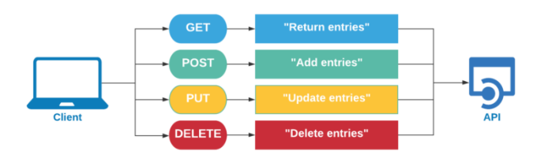
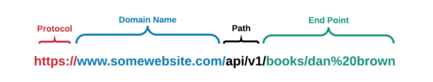
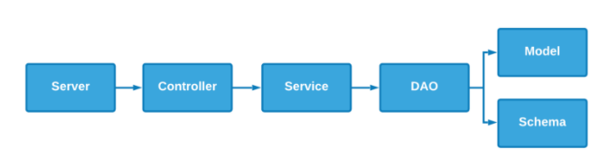
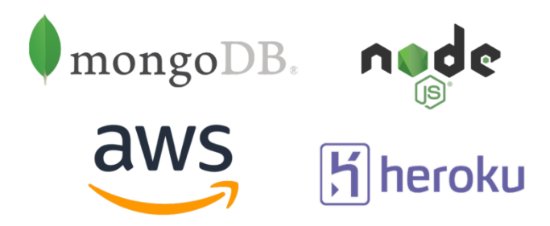

# Develop and Deploy a Scalable REST API using Node.js & Mongo.

Live Link: https://abracadabrant-vin-34977.herokuapp.com/api/v1/books

## Full Crud Operations:

## Six Different API Endpoints:

- Get All books
- Get Books by ID
- Get Books by Author
- Add New Book
- Update Existing Book
- Delete Book

## Server Architecture:

- Full decoupling of all functions
- Integration with Mongoose within DAO
- Connected to remote Mongo server

## Software Stack:

